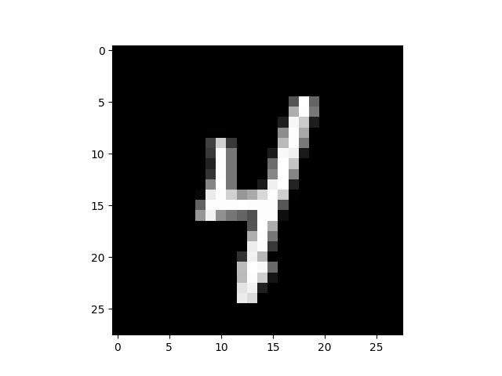

# DBN-TF2
Deep Belief Networks in Tensorflow 2


⚠️ This repository is under construction.

<hr>

## Discrete Restricted Boltzman Machine
`discrete_rbm.py` file contains the class where all logic and training code was implemented
`test_disc_rbm.py` file has the purpose of testing the RBM implementation

By default only an image was used to train and test. Obviously the reconstruction is almost perfect.

 | 

If you try with more data like 10% of training samples:
```
	...
	split=["train[:10%]"],
	...
```

You'll notice that perfection was lost...


 | 

Increase `hidden_units` can help getting better results but nothing noticeable.

<hr>