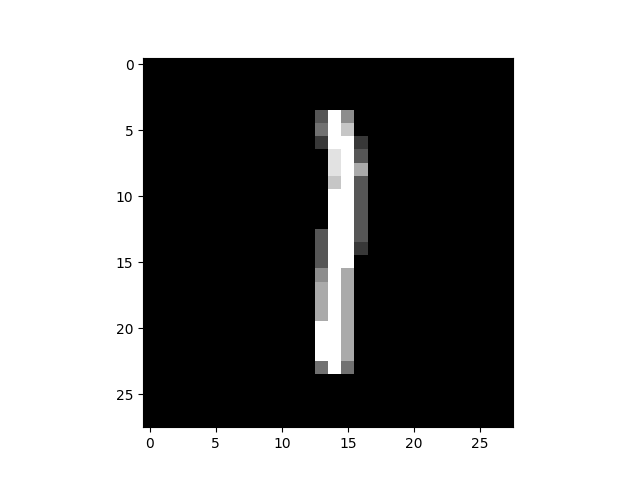
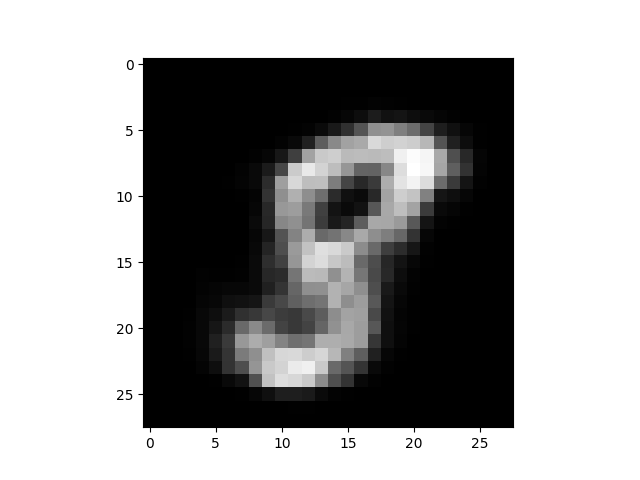
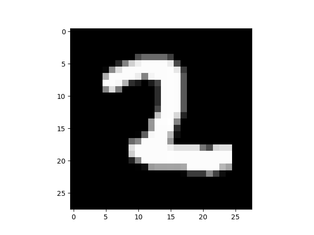
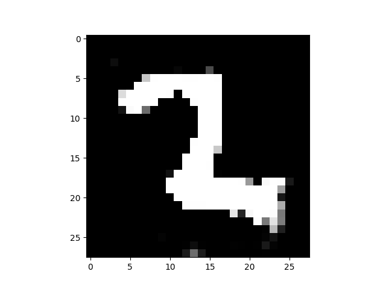

# DBN-TF2
Deep Belief Networks in Tensorflow 2

⚠️ This repository is under construction.

## Discrete Restricted Boltzman Machine
`DBN/rbm.py` file contains the class where all logic and training code was implemented
`DBN/tests.py` file has the purpose of testing the RBM implementation

By default we train with 10% of training set and use 5% of it to get images for testing if reconstruction is  good or not.

The reconstruction is done with only 1/4 of input units!

 | 

## Convolutional Restricted Boltzman Machine
`DBN/crbm.py` file contains the class where all logic and training code was implemented
`DBN/tests.py` file has the purpose of testing the RBM implementation

By default we train with 10% of training set and use 5% of it to get images for testing if reconstruction is  good or not.

Because `W` shape is `[Nᵥ-Nₕ+1, Nᵥ-Nₕ+1, K]` (where `Nᵥ` is input size and `Nₕ` is hidden layer units) small `Nₕ` values will create a big kernel `W`. 

That's why we set `Nₕ` almost equal `Nᵥ`.

 | 