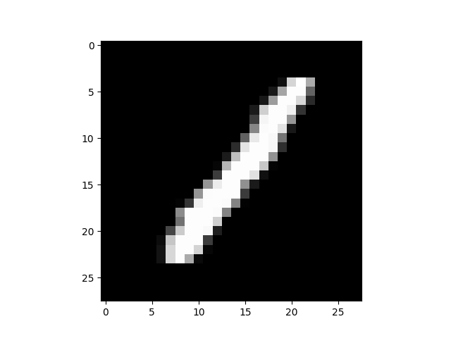
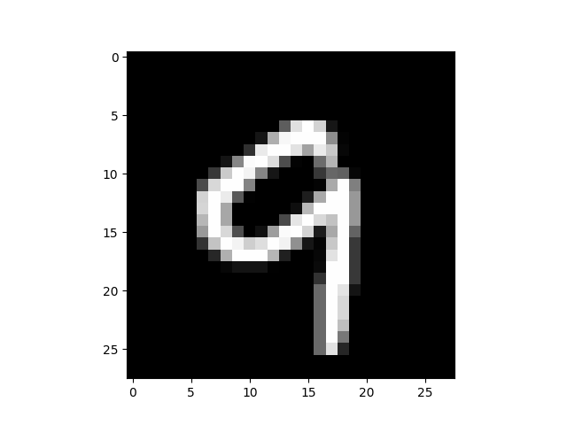

# DBN-TF2
Deep Belief Networks in Tensorflow 2

⚠️ This repository is under construction.

## Discrete Restricted Boltzman Machine
`DBN/rbm.py` file contains the class where all logic and training code was implemented
`DBN/tests.py` file has the purpose of testing the RBM implementation

By default we train with 5% of training set and use 5 of this images to test if reconstruction is  good or not.

The reconstruction is done with only 1/4 of input units!

 | 

## Convolutional Restricted Boltzman Machine
`convolutional_rbm.py` file contains the class where all logic and training code was implemented
`test_conv_rbm.py` file has the purpose of testing the RBM implementation.

Using 10% of training dataset for training and 5% for testing, we can see nice results on the reconstructions

 | 

## Problems with above models

**They only work with binary images** which means the model only turn on and off pixels (on=white; off=black)

Next step is being able to have Grayscale results!